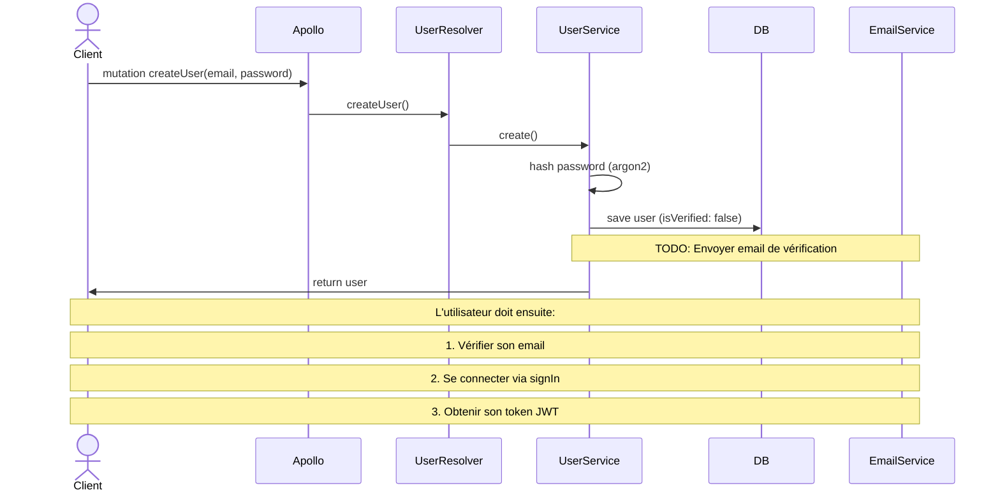
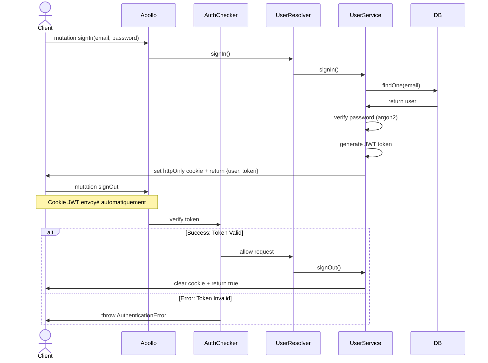
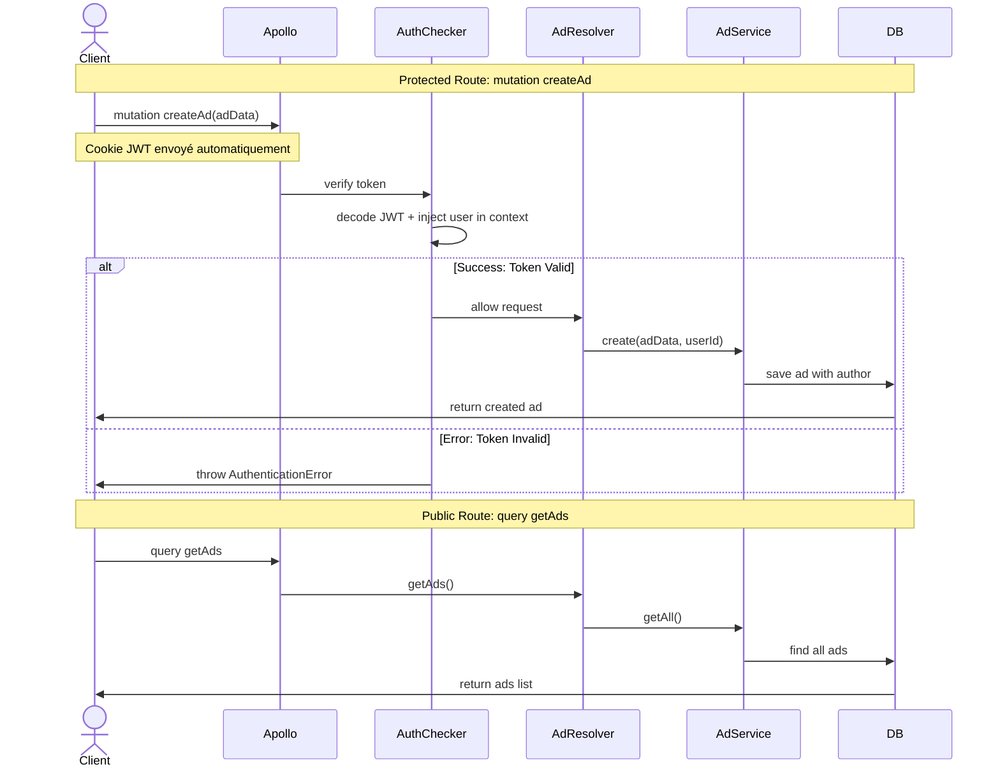

## Authentication

### Création d'un utilisateur

```mermaid
sequenceDiagram
    actor Client
    participant Apollo
    participant UserResolver
    participant UserService
    participant DB
    participant EmailService

    %% Création utilisateur
    Client->>Apollo: mutation createUser(email, password)
    Apollo->>UserResolver: createUser()
    UserResolver->>UserService: create()
    UserService->>UserService: hash password (argon2)
    UserService->>DB: save user (isVerified: false)
    Note over UserService,EmailService: TODO: Envoyer email de vérification
    UserService->>Client: return user

    %% Note sur la suite du processus
    Note over Client,EmailService: L'utilisateur doit ensuite:
    Note over Client,EmailService: 1. Vérifier son email
    Note over Client,EmailService: 2. Se connecter via signIn
    Note over Client,EmailService: 3. Obtenir son token JWT
```

---

### Flux d'authentification (SignIn/SignOut)

```mermaid
sequenceDiagram
    actor Client
    participant Apollo
    participant AuthChecker
    participant UserResolver
    participant UserService
    participant DB

    %% Connexion (SignIn)
    Client->>Apollo: mutation signIn(email, password)
    Apollo->>UserResolver: signIn()
    UserResolver->>UserService: signIn()
    UserService->>DB: findOne(email)
    DB->>UserService: return user
    UserService->>UserService: verify password (argon2)
    UserService->>UserService: generate JWT token
    UserService->>Client: set httpOnly cookie + return {user, token}

    %% Déconnexion (SignOut)
    Client->>Apollo: mutation signOut
    Note over Client,Apollo: Cookie JWT envoyé automatiquement
    Apollo->>AuthChecker: verify token
    alt Success: Token Valid
        AuthChecker->>UserResolver: allow request
        UserResolver->>UserService: signOut()
        UserService->>Client: clear cookie + return true

    else Error: Token Invalid
        AuthChecker->>Client: throw AuthenticationError
    end
```

---

### Routes protégées et publiques

```mermaid
sequenceDiagram
    actor Client
    participant Apollo
    participant AuthChecker
    participant AdResolver
    participant AdService
    participant DB

    %% Route protégée
    Note over Client,DB: Protected Route: mutation createAd
    Client->>Apollo: mutation createAd(adData)
    Note over Client,Apollo: Cookie JWT envoyé automatiquement
    Apollo->>AuthChecker: verify token
    AuthChecker->>AuthChecker: decode JWT + inject user in context
    alt Success: Token Valid
        AuthChecker->>AdResolver: allow request
        AdResolver->>AdService: create(adData, userId)
        AdService->>DB: save ad with author
        DB->>Client: return created ad
    else Error: Token Invalid
        AuthChecker->>Client: throw AuthenticationError
    end

    %% Route publique
    Note over Client,DB: Public Route: query getAds
    Client->>Apollo: query getAds
    Apollo->>AdResolver: getAds()
    AdResolver->>AdService: getAll()
    AdService->>DB: find all ads
    DB->>Client: return ads list
```

