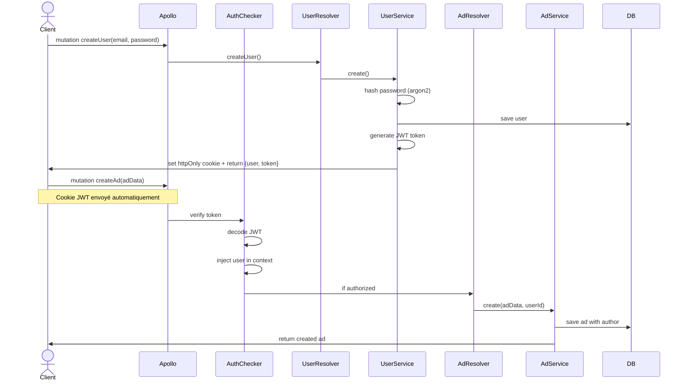

### Authentication

```mermaid
sequenceDiagram
    actor Client
    participant Apollo
    participant AuthChecker
    participant UserResolver
    participant UserService
    participant AdResolver
    participant AdService
    participant DB

    %% Création utilisateur
    Client->>Apollo: mutation createUser(email, password)
    Apollo->>UserResolver: createUser()
    UserResolver->>UserService: create()
    UserService->>UserService: hash password (argon2)
    UserService->>DB: save user
    UserService->>UserService: generate JWT token
    UserService->>Client: set httpOnly cookie + return {user, token}

    %% Création annonce (authentifiée)
    Client->>Apollo: mutation createAd(adData)
    Note over Client,Apollo: Cookie JWT envoyé automatiquement
    Apollo->>AuthChecker: verify token
    AuthChecker->>AuthChecker: decode JWT
    AuthChecker->>AuthChecker: inject user in context
    AuthChecker->>AdResolver: if authorized
    AdResolver->>AdService: create(adData, userId)
    AdService->>DB: save ad with author
    AdService->>Client: return created ad   
```
